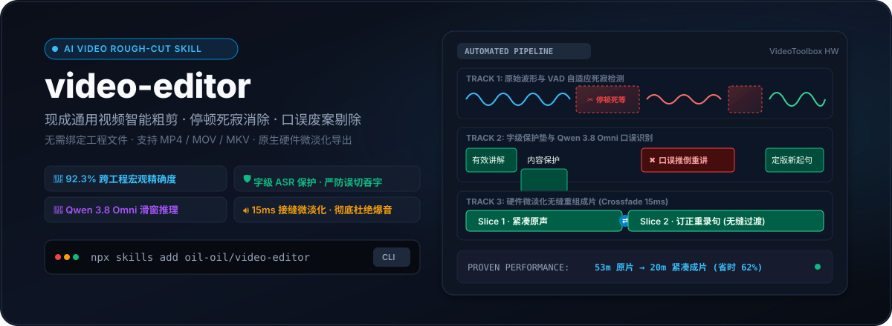

<p align="center">
  
</p>

# video-editor

粗剪现成视频：压缩停顿、识别口误与重讲，生成可复核的计划、审计报告和新视频。适合以口播为主的教程和讲解，正式使用前仍需复核语义和接缝听感。

[快速开始](#快速开始) · [核心用法](#核心用法) · [历史评测记录](#历史评测记录) · [数据边界](#数据边界)

---

## 有什么用

视频创作者在录制口播、教程、会议或演讲时，粗剪往往耗费大量人工：
- **不使用时**：需要手动逐个排查并删除几百处几百毫秒的死寂气口；人工拉片识别重讲口误容易漏删或手抖吞字；跳切边缘缺少微淡化容易产生刺耳的“咔哒”爆音。
- **使用后**：通过 ASR 字保护和滑窗分析提出停顿及口误删减；验证替代话术不会一起被删，使用区间内波形吸附和 15ms 微淡化减轻接缝杂音。

> **边界说明**：本工具用于**现成通用视频文件**（MP4 / MOV / MKV）。若需处理 Screen Studio 原生工程，请使用 `screen-studio-editor`；成片字幕生成与烧录请使用 `oil-subtitle`。

---

## 快速开始

### 1. 安装 Skill

**方式 A：让 Agent 安装（推荐）**
向你的 Agent 发送：
```text
请帮我安装这个 Skill：https://github.com/oil-oil/video-editor
```

**方式 B：通过 skills CLI 安装**
```bash
npx skills add oil-oil/video-editor
```

### 2. 环境与依赖

- 系统环境：macOS（原生支持 VideoToolbox 硬件加速）或 Linux
- 软件依赖：Python 3.10+、`ffmpeg`、`ffprobe`；macOS 已验证，Linux 有编码分支但尚未实机验收。
- 首次使用安装 Python 虚拟环境与依赖：
  ```bash
  bash setup.sh
  ```

### 3. API Key 配置

只有 ASR 使用阿里云百炼 DashScope API：优先通过 bl CLI 调用 fun-asr，未安装 bl 时使用 SDK 的 paraformer-realtime-v2。语义判断由调用 Skill 的 Agent 根据本地带时间戳转录完成，不调用外部模型。离线 review/render 不需要 Key。

**使用随附安全配置页：**
需要 Node.js 22.18+；以下命令在 Skill 目录执行。
```bash
npm --prefix scripts/credential-ui ci --ignore-scripts
node scripts/credential-ui/src/profile.ts status default
node scripts/credential-ui/src/profile.ts setup default
```
终端会输出本机安全链接，由你亲自打开网页填写。凭据保存在系统的安全钥匙串（macOS Keychain / Windows Credential Manager / Linux Secret Service）中。

已有安全环境注入 `DASHSCOPE_API_KEY` 或 bl 配置时可直接复用。不要把真实 Key 贴进聊天或命令参数。

---

## 核心用法

### 1. Agent 参与的智能粗剪（推荐）

先让程序准备转录上下文，再由调用 Skill 的 Agent 判断语义删减，最后导出剪辑后的新视频：

```bash
bash scripts/run.sh cut /path/to/video.mp4
```

第一次运行会在 `.<name>.<ext>_work/semantic_context.json` 写入带时间戳的原子片段和判断规则。Agent 读完后，在同目录写 `semantic_plan.json`，再执行：

```bash
bash scripts/run.sh cut /path/to/video.mp4 \
  --semantic-plan /path/to/.video.mp4_work/semantic_plan.json \
  -o /path/to/video_edited.mp4
```

- 默认使用 macOS 原生 `h264_videotoolbox` 硬件加速。
- 自动提取音频校准底噪、FunAudio ASR 字级转录、自适应停顿切除、Agent 语义判断、波形极值吸附与 15ms 微淡化组装。
- 两套剪辑 Skill 统一使用同一套停顿规则：连续无声超过 **300ms** 才进入剪辑候选，剪后保留约 **180ms** 气口；底层 250ms 探测窗口只负责发现候选，不会直接触发剪辑。ASR 时间戳和无声区重叠时只做复核提示，不自动阻止音频剪辑。

### 2. 预览分析与审计报告（Dry-run）

若先不出片，只查看上下文并让 Agent 先判断：

```bash
bash scripts/run.sh cut /path/to/video.mp4
```

程序会生成 `.<name>.<ext>_work/semantic_context.json`。Agent 写出 `semantic_plan.json` 后，再加 `--semantic-plan` 执行第二步，才会生成详细报告。

### 3. 近似流拷贝预览（免重编码）

仅用于接受关键帧偏差的预览，可能保留本想删除的切点附近内容，不应用淡化；报告会标出实际时长和计划偏差。正式成片建议使用默认重编码：

```bash
bash scripts/run.sh cut /path/to/video.mp4 --semantic-plan /path/to/.video.mp4_work/semantic_plan.json --fast-copy -o /path/to/video_fast.mp4
```

### 4. 离线复核与按计划导出

```bash
bash scripts/run.sh review /path/to/video.mp4
bash scripts/run.sh render /path/to/video.mp4 -o /path/to/video_edited.mp4
```

先用 `cut` 生成上下文，再由 Agent 写 `semantic_plan.json` 并完成一次带 `--semantic-plan` 的分析。可编辑生成的计划中的 `kept_intervals`（源视频毫秒坐标）再 render；不重新分析、不调用云端。源文件改变后必须重新 cut。已有成片默认拒绝覆盖，需要时显式加 `--overwrite`；永不覆盖源片。

分析失败不会生成成功报告；有效音频和转录可复用后重试。相同文件名重新导出或更换内容会使缓存失效。默认编码为有损 H.264/AAC，不承诺无损或零误删。

---

## 历史评测记录

下表保留已有历史记录；当前仓库尚未包含对应的标注、评测脚本和版本绑定，不能作为当前版本的准确率保证。

原记录在 5 个真实历史视频项目（涵盖短片口播、深度实操与长篇教程，累计 53.3 分钟原始视频）上，与专业创作者人工精剪定版数据（Human Ground Truth）进行毫秒级重合比对：

| 评测视频工程 | 原始时长 | 人工切除总长 | 算法切除总长 | 重合时长 | 精确率 (Precision) | 召回率 (Recall) | 综合得分 (F1) |
| :--- | :--- | :--- | :--- | :--- | :--- | :--- | :--- |
| **09-17 短片口播** | 03:50 (230s) | 74.1s | 70.3s | **65.7s** | **93.48%** 🎯 | **88.59%** 🚀 | **90.97%** |
| **09-13 短片口播** | 07:30 (450s) | 243.1s | 225.4s | **211.9s** | **94.00%** 🎯 | **87.16%** 🚀 | **90.45%** |
| **09-14 演示实录** | 07:11 (431s) | 207.4s | 174.1s | **160.1s** | **91.97%** 🎯 | **77.21%** 🚀 | **83.95%** |
| **09-16 长篇实操** | 14:25 (865s) | 410.6s | 413.1s | **372.9s** | **90.27%** 🎯 | **90.82%** 🚀 | **90.54%** |
| **09-16 深度讲解** | 20:25 (1225s) | 350.2s | 340.8s | **304.9s** | **89.45%** 🎯 | **87.07%** 🚀 | **88.25%** |
| **5 工程大盘总计** | **53:21 (3196s)** | **1285.4s** | **1223.7s** | **1115.5s** | **91.16%** 🎯 | **86.78%** 🚀 | **88.92%** |

删除区间的重合精确率不能证明零误删。正式效果评估还需要独立检查语义误删、漏删和接缝听感；耗时与成本应记录素材规格、缓存状态、模型及是否包含渲染。

---

## 数据边界

- **本地处理**：视频切片、画面重构与硬件渲染 100% 在创作者本机执行，视频画面永不上云。
- **云端服务**：
  - 提取的音频发送至阿里云百炼 ASR 进行字级转录。
  - 转录后的文本片段（含时间戳与停顿标记）保存在本地 `semantic_context.json`，由调用 Skill 的 Agent 进行语义口误判断；不会发送给外部语义模型。
- **凭据**：新配置使用系统凭据服务或环境注入；兼容读取已有 bl 配置，不新增明文 Key 文件，不写入工程或报告。

---

## 开源协议

[MIT](LICENSE) © 2026 oil
